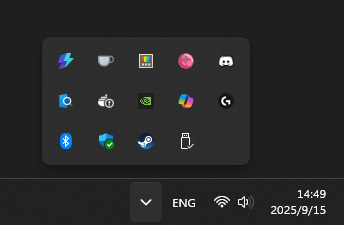
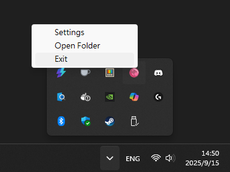

+++
date = '2025-08-27T3:00:00+08:00'
draft = false
title = 'HotkeyTray - 托盤監聽截圖工具'
categories = ['automation']
tags = ['工具']
+++

## HotkeyTray - 托盤監聽截圖工具試工具

### 為什麼會有這個工具
在多螢幕環境下工作時，截圖常常是一件麻煩事。  
Windows 內建的截圖工具要不就是需要手動框選範圍，要不就是整個螢幕，  
如果我只想要「左螢幕一鍵截圖」或「右螢幕一鍵截圖」，就顯得很笨重。  

於是我動手寫了一個小工具 —— **HotkeyTray**。  
它是一個常駐在系統托盤的 Python 程式，只要設定好快捷鍵，就能隨時一鍵截圖並自動儲存。  



---

### 工具簡介

- 名稱：HotkeyTray  
- 功能特色：
  - 系統托盤常駐，不佔畫面
  - 設定快捷鍵截取左螢幕、右螢幕
  - 設定檔可自訂快捷鍵、儲存路徑
- 適用情境：
  - 遠端開會快速截圖
  - 文件製作
  - 一般多螢幕日常使用  



---

### 技術堆疊

- **Python**  
- **pystray**：系統托盤功能  
- **keyboard**：快捷鍵偵測  
- **Pillow**：影像處理  
- **dotenv + JSON**：設定管理  

---

### 安裝與使用

#### 安裝
- 可以直接下載 EXE 檔執行  
- 或者用 Python 自行執行：  

```bash
git clone https://github.com/henry43171/HotkeyTray.git
cd HotkeyTray
python src
```

#### 使用步驟
1. 啟動程式後，系統托盤會出現 **HotkeyTray** 圖示  
2. 預設快捷鍵：  
   - `Alt+1` = 左螢幕截圖  
   - `Alt+2` = 右螢幕截圖  
3. 截圖會自動存到 `screenshots/` 資料夾  

---

### 開發過程的小插曲

這原本只是個簡單的小工具，但過程中還是踩了不少坑：  

- 一開始有兩份 `load_config`，搞到自己亂掉  
- 一度遇到「修改設定後不會馬上套用」的問題  
- 才發現，就算小專案也會遇到維護性挑戰  

這些問題讓我開始理解「程式碼乾淨」與「可維護性」的重要性。  

---

### 未來計畫

- 更直覺的設定 UI  
- 支援更多快捷鍵動作（例如複製到剪貼簿、不存檔）  

---

### 結語

如果你也覺得多螢幕截圖麻煩，或許這個小工具能幫到你。  
程式碼已經放在 GitHub，歡迎下載試試。  

GitHub 連結：[https://github.com/henry43171/HotkeyTray](https://github.com/henry43171/HotkeyTray)
