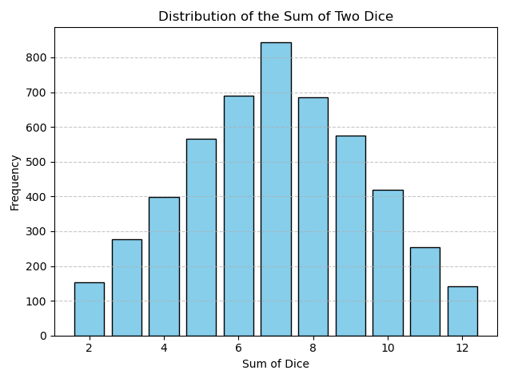
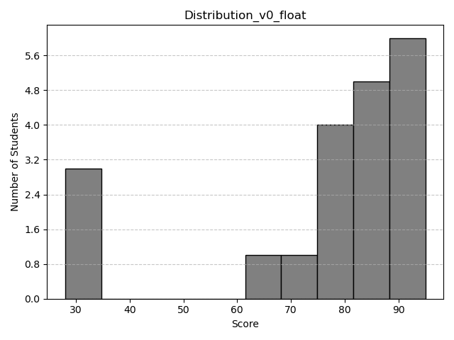
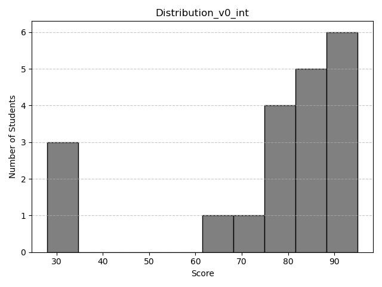
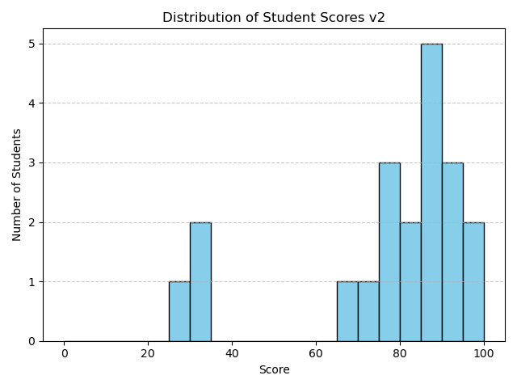

+++
date = '2025-04-23T14:46:27+08:00'
draft = false
title = 'Numpy 練習紀錄'
categories = ['Numpy']
tags = ['資料整理', '基本語法']
+++
## Numpy 練習紀錄
### 基本運算
可以用 numpy 來進行一些基本運算，NumPy 的陣列運算是「元素對元素」的操作（element-wise），包含加減乘除、根號、次方等等。
```python
import numpy as np

# 基本運算
import numpy as np

a = np.array([1, 4, 9])
b = np.array([4, 5, 6])

print("\n numpy array a=", a)
print("\n numpy array b=", b)

print("\n加法\na+b=", a+b)
print("\n減法\na-b=", a-b)
print("\n乘法\na*b=", a*b)
print("\n除法\na/b=", a/b)
print("\n根號\na=", np.sqrt(a))
print("\n倍數\nb*2=", b*2)
print("\n次方\nb**2=", b**2)
```

numpy array 和 list 的差別，numpy如果乘2，會把各個元素逐一乘2；list如果乘2，會將整個list複製一份。
```python
import numpy as np

# 和 list 比較
print("\n"+"---"*30)
lista = [1, 2, 3]
print("lista = ", lista) # lista =  [1, 2, 3]
print("lista*2 = ", lista*2) # lista*2 =  [1, 2, 3, 1, 2, 3]
```

### 廣播(Broadcasting)
在 NumPy 中，大多數的運算都是「逐元素運算」（element-wise operation）。

如果想將一個較小的陣列與較大的陣列一起運算，就可以用到 Broadcasting（廣播機制）。  
像是 `+10` 這樣的加法，會直接將每個元素都加上 10；而如果是乘上一個陣列的話，就要注意兩個陣列的形狀是否相容，才能正確進行廣播運算。
```python
import numpy as np

broadcast_arr = np.arange(1,7).reshape(2,3)
print(broadcast_arr)

print("\n加一個數字 10")
print(broadcast_arr+10)

print("\n乘一個陣列(new_arr) [1, 2, 3]")
new_arr = np.array([1, 2, 3])
print("# broadcast_arr.shape = ", broadcast_arr.shape)
print("# new_arr.shape = ", new_arr.shape)
print(broadcast_arr*new_arr)
```

### dot 與 matmul 基礎
在 NumPy 中，如果要進行矩陣乘法（也就是線性代數裡的「內積」），有幾種方式可以使用：`np.dot()`、`np.matmul()`，還有比較 Python 的 `@` 運算子。

這三種方式在處理 2 維陣列時基本上是等效的：
```python
import numpy as np

a = np.array([[1, 2]
            ,[3, 4]])

b = np.array([[4, 3]
            ,[2, 1]])

print("\n np.dot(a, b): \n", np.dot(a, b))
print("\n np.matmul(a, b): \n", np.matmul(a, b))
print("\n @ 運算子 \n", a@b)
```

在這裡：
- np.dot() 是早期常見的用法，不只可以用在矩陣乘法，也可以做向量內積。
- np.matmul() 是為了明確表示「矩陣乘法」而設計的方法。
- @ 是 Python 3.5 之後新增的運算子，寫起來最簡潔，也最符合數學上的寫法。

備註：這裡只針對 2D 陣列的情境做說明，更高維度的運算結果可能會有所不同。

### 總和、平均、標準差
#### 基礎操作
在 NumPy 中，可以很方便地對陣列進行統計運算，例如總和（sum）、平均（mean）和標準差（std）。這些方法都可以搭配 `axis` 參數來指定要在「哪個維度」進行運算。
```python
import numpy as np

# 建立一個 2D 陣列
arr = np.array([[1, 2, 3],
                [4, 5, 6],
                [7, 8, 9]])

print("原始資料：")
print(arr)

# 計算總和
print("\n總和 (sum)：")
print(np.sum(arr))  # 所有元素的總和
print(np.sum(arr, axis=0))  # 每列的總和
print(np.sum(arr, axis=1))  # 每欄的總和

# 計算平均數
print("\n平均數 (mean)：")
print(np.mean(arr))  # 所有元素的平均
print(np.mean(arr, axis=0))  # 每列的平均
print(np.mean(arr, axis=1))  # 每欄的平均

# 計算標準差
print("\n標準差 (std)：")
print(np.std(arr))  # 所有元素的標準差
print(np.std(arr, axis=0))  # 每列的標準差
print(np.std(arr, axis=1))  # 每欄的標準差
```

#### 實戰統計分析練習
模擬一筆資料並進行統計分析(mean, std, var, max, argmax)。

其中 `argmax` 是一個很實用的函式，它會回傳最大值「第一次出現」的索引位置。
```python
# 模擬一筆資料（可以是某種測量數據、分數等等）
data = np.array([5, 12, 7, 9, 15, 3, 8])

# 基本統計指標
print("Data:", data)
print("Mean (平均):", np.mean(data))
print("Standard Deviation (標準差):", np.std(data))
print("Variance (變異數):", np.var(data))
print("Max (最大值):", np.max(data))
print("Argmax (最大值的索引):", np.argmax(data))
```

#### 隨機資料的統計分析（延伸應用）
可以用 Numpy 生成一些隨機資料，，並進行簡單的統計分析。

這邊是一個簡單的畫圖程式。
```python
import numpy as np
import matplotlib.pyplot as plt

# 繪圖函式
def show_visual(data, title):
    plt.hist(data, bins=30, edgecolor='black')
    plt.title(title)
    plt.xlabel("Value")
    plt.ylabel("Frequency")
    plt.show()
```

可以先看看常見的兩種分布，分別是常態分佈、均勻分布。
```python
# 生成1000個服從常態分布的數據，均值為0，標準差為1
normal_data = np.random.normal(loc=0, scale=1, size=1000)
# 查看生成的數據的簡單統計
print("常態分布數據的平均值:", np.mean(normal_data))
print("常態分布數據的標準差:", np.std(normal_data))
show_visual(normal_data, "Normal Distribution")

# 生成1000個服從均勻分布的數據，範圍是[0, 10]
uniform_data = np.random.uniform(low=0, high=10, size=1000)
# 查看生成的數據的簡單統計
print("\n均勻分布數據的平均值:", np.mean(uniform_data))
print("均勻分布數據的標準差:", np.std(uniform_data))
show_visual(uniform_data, "Uniform Distribution")
```

### 骰子模擬：觀察隨機分布
這個練習的目標是模擬擲骰子的情境，並透過簡單的統計與視覺化，觀察點數的分布狀況。

練習目標
- 使用 np.random.randint(1, 7, size=5000) 模擬 5000 次擲骰子。
- 計算每個點數出現的次數。
- 使用 plt.bar() 或 plt.hist() 將結果視覺化。

```python
import numpy as np
import matplotlib.pyplot as plt

# 定義骰子
def dice_roll(dice_num, size):
    dice = np.random.randint(1, 7, size=size)
    values, counts = np.unique(dice, return_counts=True)
    print(f"{dice_num}")
    for val, count in zip(values, counts):
        print(f"點數 {val} 出現了 {count} 次")
    return dice

# 分別擲骰子
dice_1 = dice_roll("dice_1", 5000)
dice_2 = dice_roll("dice_2", 5000)

# 總和相加並統計次數
print("---"*30)
print("骰子點數相加")
values, counts = np.unique(dice_1+dice_2, return_counts=True)
for val, count in zip(values, counts):
    print(f"相加點數 {val} 出現了 {count} 次")

# 原始圖表
# plt.bar(values, counts)
# plt.xticks(np.arange(values.min(), values.max()+1))  # 顯示 2~12 的點
# plt.xlabel("點數")
# plt.ylabel("次數")
# plt.title("骰子點數分布")
# plt.show()

# 美化圖表(English version)
plt.bar(values, counts, color='skyblue', edgecolor='black')
plt.xlabel("Sum of Dice")
plt.ylabel("Frequency")
plt.title("Distribution of the Sum of Two Dice")
plt.grid(axis='y', linestyle='--', alpha=0.7)
plt.tight_layout()
plt.show()
```


如果擲骰子的次數較少，點數的分布會有比較分散、不穩定的明顯偏差；隨著投擲次數的增加，分布會逐漸趨近理論上的平均，也就是類似鐘形曲線的樣子。


### 成績分布模擬
這個練習的目標是模擬學生成績分布，並觀察成績的分布情況。

練習目標
- 使用宣告的方式輸入20個隨機生成的學生成績。
- 使用 matplotlib 繪製學生成績的直方圖。

```python
import numpy as np
import matplotlib.pyplot as plt
import matplotlib.ticker as ticker

# 宣告學生姓名與成績
students_scores = {
    "Alice": 88, "Ben": 92, "Cathy": 79, "David": 85, "Ella": 95,
    "Frank": 68, "Grace": 74, "Henry": 91, "Ivy": 84, "Jack": 77,
    "Kathy": 81, "Leo": 90, "Mia": 31, "Nina": 85, "Oscar": 89,
    "Paul": 78, "Queen": 88, "Ryan": 95, "Sara": 32, "Tom": 28
}

# 抽取成績列表做統計
scores = list(students_scores.values())
print("All scores:", scores)

# 計算統計數據
mean_score = np.mean(scores)
std_score = np.std(scores)
min_score = np.min(scores)
max_score = np.max(scores)

# 輸出統計信息
print(f"mean_score: {mean_score:.2f}")
print(f"std_score: {std_score:.2f}")
print(f"min_score: {min_score}")
print(f"max_score: {max_score}")

# 繪製成績分布圖(直方圖)
def bar_visualize(bins, color, edgecolor, title):
    """
    繪製學生成績的直方圖，並將圖表儲存為 PNG 圖片。

    參數:
    - bins (int 或 array-like): 直方圖的區間數或邊界。
    - color (str): 直方圖柱子的顏色。
    - edgecolor (str): 柱子邊框的顏色。
    - title (str): 圖表標題，也會用來命名輸出的圖片檔案。
    """
    plt.hist(scores, bins=bins, color=color, edgecolor=edgecolor)
    plt.xlabel("Score")
    plt.ylabel("Number of Students")
    plt.title(title)
    plt.grid(axis='y', linestyle='--', alpha=0.7)
    plt.gca().yaxis.set_major_locator(ticker.MaxNLocator(integer=True))
    plt.tight_layout()
    plt.savefig(f"{title}.png")
    plt.show()

bar_visualize(bins = 10, 
              color = 'pink',
              edgecolor = 'black',
              title = "Distribution of Student Scores v1")

bar_visualize(bins = np.arange(0, 101, 5), 
              color = 'skyblue',
              edgecolor = 'black',
              title = "Distribution of Student Scores v2")
```

如果 Y 軸沒有特別設定的話，在 Y 軸上面有可能會出現顯示成浮點數的情況，但這邊的 Y 軸是學生人數，有浮點數很奇怪。




不想要顯示浮點數的話，可以加上 `ticker`，讓他強制使用整數。
```
import matplotlib.ticker as ticker

def bar_visualize(bins, color, edgecolor, title):
    """
    pass
    """
    plt.gca().yaxis.set_major_locator(ticker.MaxNLocator(integer=True))
```

以下是完整的繪圖程式。
```python
# 完整的繪圖程式碼

import numpy as np
import matplotlib.pyplot as plt
import matplotlib.ticker as ticker # 新增的部分

def bar_visualize(bins, color, edgecolor, title):
    plt.hist(scores, bins=bins, color=color, edgecolor=edgecolor)
    plt.xlabel("Score")
    plt.ylabel("Number of Students")
    plt.title(title)
    plt.grid(axis='y', linestyle='--', alpha=0.7)
    plt.gca().yaxis.set_major_locator(ticker.MaxNLocator(integer=True)) # 新增的部分
    plt.tight_layout()
    plt.savefig(f"{title}.png")
    plt.show()

bar_visualize(bins = 10, 
              color = 'grey',
              edgecolor = 'black',
              title = "Distribution of Student Scores v0")
```

更新後的圖片， Y 軸就不會有浮點數了。



另外需要特別注意圖表的部分，如果 `bin` 沒有特別指定，他會依據數值的區間來自動化分，所以對齊的時候看起來會不太整齊。
```python
bar_visualize(bins = 10, 
              color = 'pink',
              edgecolor = 'black',
              title = "Distribution of Student Scores v1")
```


為了解決這個狀況，可以手動指定 `bin` 的區間，讓他強制對齊，例如指定從 0 ~ 101，以5為間隔進行對齊。
```python
bar_visualize(bins = np.arange(0, 101, 5), 
              color = 'skyblue',
              edgecolor = 'black',
              title = "Distribution of Student Scores v2")
```



