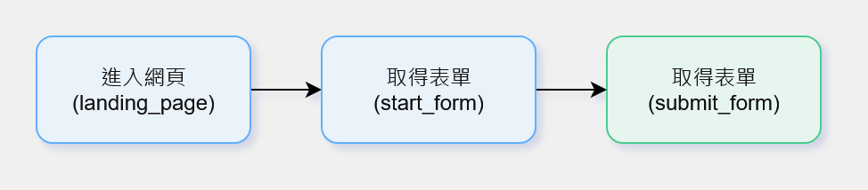
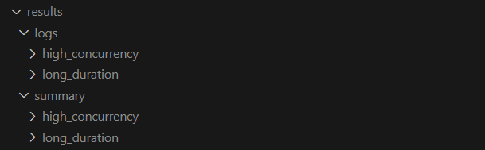
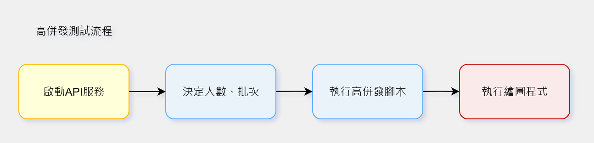
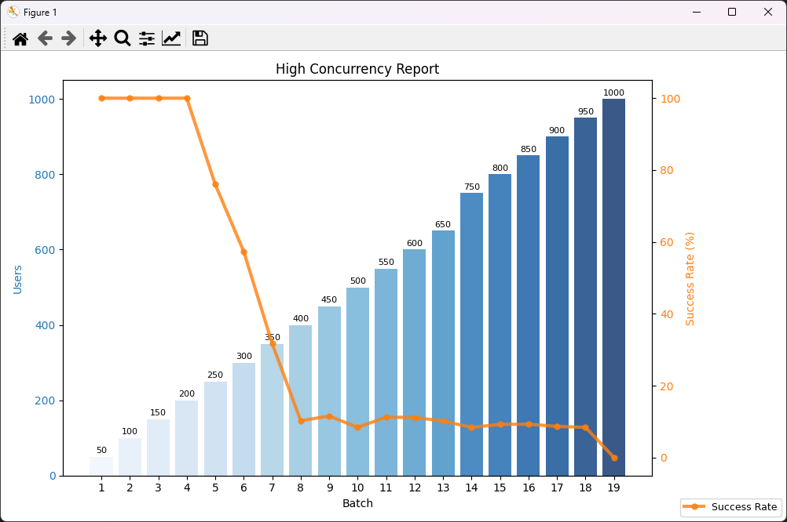
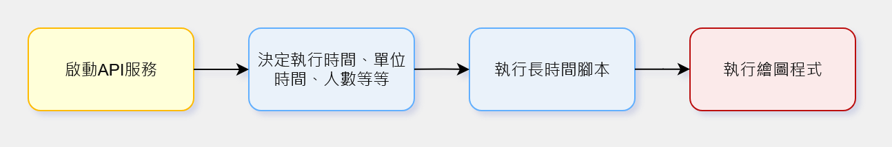
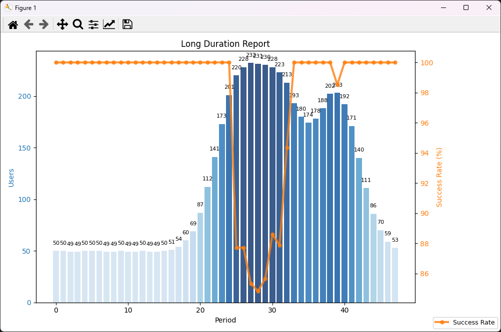
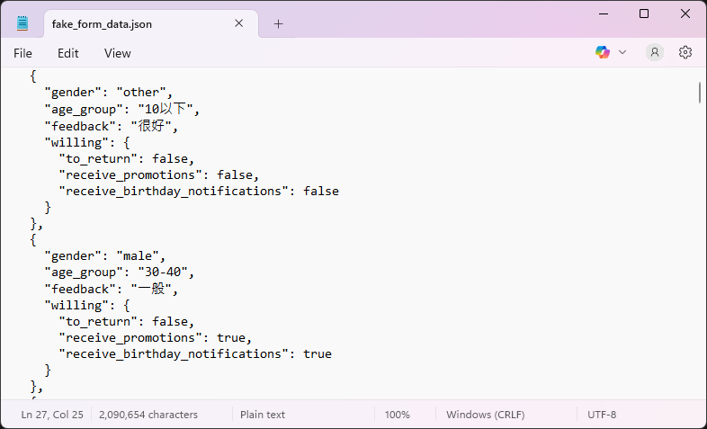

+++
date = '2025-10-07T15:30:00+08:00'
draft = false
title = "API Stress Test Demo - API壓力測試測試工具"
tags = ["自動化", "工具", "QA"]
+++
## API Stress Test Demo - API壓力測試測試工具

## 背景與動機
在開發與維運階段，API 的穩定性對系統可用性至關重要。本專案建立一套可重複、參數化的測試流程，涵蓋 API 設計、log 管理與結果視覺化，完整支援「測試 → 分析 → 回饋」循環。

- 模擬真實 API 使用情境：進入頁面、取得表單、提交資料。
- 搭配不同測試模式：高併發與長時間測試，對應瞬間負載與長期穩定性。
- 結構化 log 與圖表報告：便於即時觀察與性能優化。
- 快速反映 API 在不同壓力下的表現，協助 QA 與開發團隊早期發現瓶頸。

---

## 工具組成與特色

### API 設計  

- 採用模組化結構，每個 API 測試腳本以獨立函式存在，可由主控制模組動態呼叫。
- 測試函式支援以 lambda 傳入參數，靈活組合不同場景，例如：  
  `('submit_form', lambda: submit_form({**data, 'current_users': total_users}))`
- 以統一接口格式傳遞請求與結果，避免各 API 間的結構不一致。
- 流程設計包含：
  1. 進入網頁（GET）  
  2. 取得表單資料（GET）  
  3. 提交表單（POST）  
- 支援基本的負載模擬，可依參數設定人數上限，模擬真實環境的請求行為。

---  

### Log 管理  
- 以 logging 模組集中管理所有測試日誌。
- 採用雙層 Log 機制：  
  1. results/logs：完整保留每次呼叫API的紀錄
  2. results/summary：將logs的統計結果記錄在summary資料夾，方便查看以及視覺化  
- Log 格式包含時間戳記、狀態與延遲時間，方便日後比對。
- 自動生成每日 log 檔案，命名格式如：`hc_50u_20251007_091733.log`。
- 並區分不同測試模式（高併發 / 長時間），各自擁有獨立資料夾與流水號，方便追蹤。
- 若測試異常中斷，仍可根據已記錄的 log 觀測測試結果。

  

---  

### 高併發測試設計
- 目標：模擬大量使用者同時訪問 API，測試系統瞬間負載承受能力，搭配不同人數規模，可看出API瓶頸。
- 實作：可設定使用者數量，進行不同規模的併發測試。
- 成果呈現：
  - 可視化報表顯示每次測試的成功率
  - 測試過程與結果自動記錄於 log 檔
- 高併發流程圖
  
- 高併發測試報表
  

### 長時間測試設計
- 目標：模擬系統長時間運行，觀察性能穩定性與潛在瓶頸，實務上可用於檢驗各時段的API負載。
- 實作：依照參數設定時間單位與使用者數量，模擬不同時段流量變化。
  - test_total_time: 1200
  - test_unit_time: 48
  - unit_users: 100
- 成果呈現：
  - 單位時間的成功率變化趨勢
  - 長時間運行下系統性能衰減分析
  - 測試結果可作為後續優化依據
- 長時間流程圖
  
- 長時間測試報表
  

### 假資料生成
- 提供測試所需的假資料，模擬真實使用情境
- 可快速生成多筆資料，支援所需要的測試場景
    

### 成果與價值
- 自動生成測試報告與日誌，提供圖表與文字摘要，顯示人數與 API 成功率 。 
- 結果可視化，便於觀察高併發或長時間測試下的性能波動。
- 提升測試效率並降低人工操作成本，快速回饋開發團隊。
- 展示 QA 與測試工具設計能力，具高可擴展性，可整合更多自動化流程。

---

## 後續方向
- 擴展測試腳本與報告功能，模擬不同使用者行為與 API 負載。
- 優化結果視覺化與操作流程（如 GUI 介面）。
- 支援更多 API 類型與測試場景。
