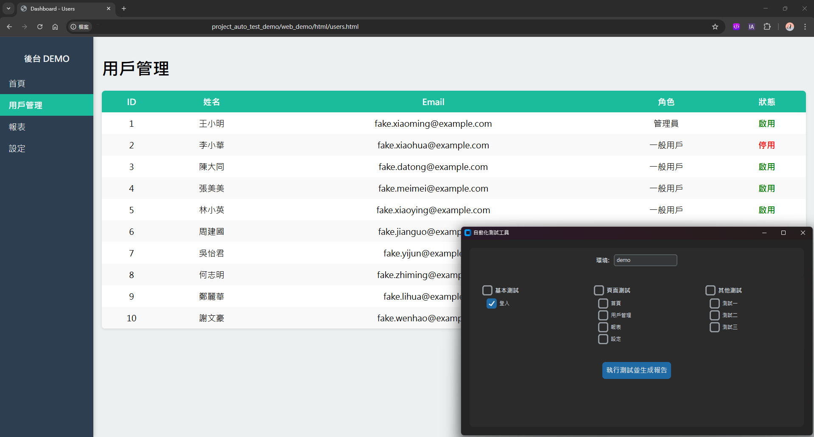
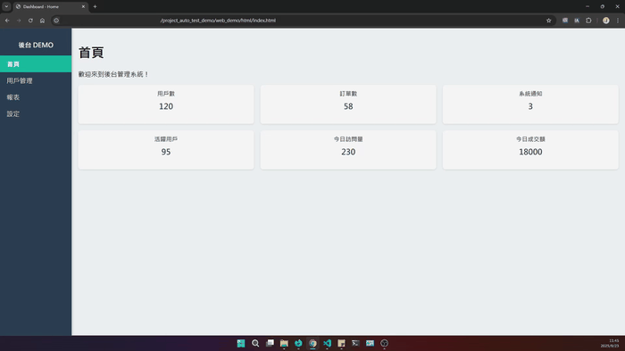
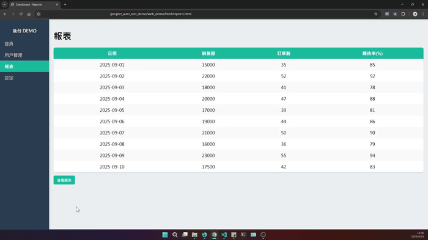
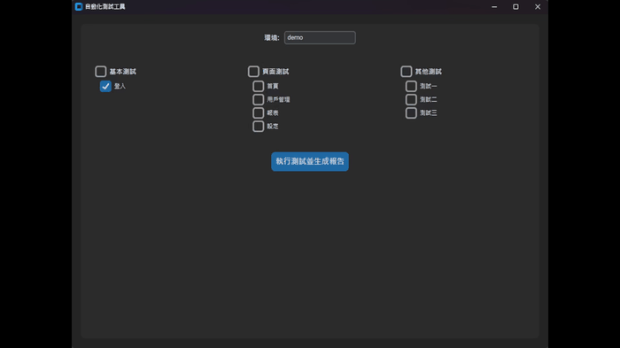
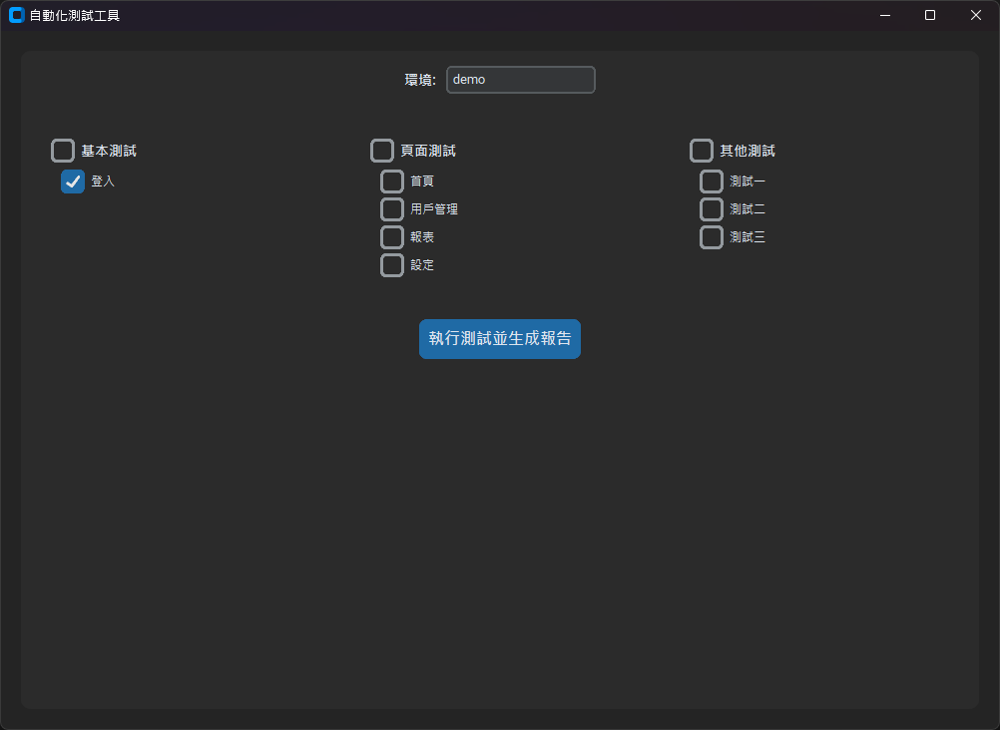

+++
date = '2025-09-02T12:00:00+08:00'
draft = false
title = "Auto Test Demo - 自動化測試工具"
tags = ["自動化", "工具", "QA"]
+++
## Auto Test Demo - 自動化測試工具

### 背景與動機
在過去的專案中，我經常需要手動測試後台系統功能，這不僅耗時，也容易因人為操作而出現錯誤。為了提高測試效率並建立可重複使用的流程，我設計了 **Auto Test Demo**，一個結合 **DEMO 網頁** 與 **自動化測試工具** 的完整方案。

**DEMO 網頁**模擬後台系統與報表展示，資料皆為假資料，僅用於展示自動化工具使用；**自動化測試工具**提供 GUI 介面來執行 Selenium 測試案例，並生成 HTML 測試報告。透過這個整合方案，我可以快速驗證系統功能、展示報表互動，並降低手動測試成本。

---

### 工具組成與特色

#### 1. DEMO 網頁
提供完整的後台管理介面，涵蓋首頁、用戶管理、報表與設定頁面，模擬真實後台操作情境。

**主要特色**：
- 模擬多筆假資料，呈現真實使用情境，便於展示自動化測試效果。

- 報表頁面支援互動式圖表（折線圖 + 柱狀圖），清楚呈現每日銷售額與轉換率，使資料呈現更貼近實際使用情境。

- 簡單直觀的頁面操作，操作過程可直接展示和驗證功能。

#### 2. 自動化測試工具
基於 Python 與 Selenium 的 GUI 工具，提供模組化測試方案，能自動執行測試並生成 HTML 報告。

**主要特色**：
- GUI 可選擇測試模組與執行環境，操作簡單直覺。
- 自動執行後生成可讀性高的 HTML 報告，顯示頁面資料是否正常呈現。
- **模組化設計**：新增測試模組不會影響原有功能，方便維護與擴充。
- 可與 DEMO 網頁互動，驗證報表與圖表功能是否正確呈現。
- 適應職場快速迭代環境（兩週一次），手動 GUI 執行比完全自動化 CI/CD 更靈活。

---

### 使用方式（使用者面向）
1. 開啟 GUI 工具，選擇欲執行的測試模組。

2. 點擊執行，程式將自動進行後台操作模擬與報表檢查。  
3. 測試完成後，生成 HTML 報告供檢視測試結果。

> **亮點**：操作直覺，非技術使用者亦可輕鬆執行測試；可依據需求決定測試項目；支援切換不同測試環境（開發/測試/UAT）。

---

### 開發者面向
- **模組化、低耦合設計**：新增頁面或功能不影響既有流程，易於快速迭代。  
- 易於維護與擴展，測試模組可靈活調整，符合快速迭代需求。  
- 測試重點聚焦頁面資料是否正常呈現，避免因測試環境資料混亂造成誤判。

---

### 設計決策與判斷理由
- **手動 GUI 執行而非 CI/CD 自動化**：由於 UI 元件頻繁變動，手動觸發更靈活，維護成本低，快速回饋開發團隊。  
- **驗證頁面資料存在**：實務上測試環境資料可能混亂，重點是頁面與報表是否正確呈現。  
- **斷言檢查流程正確性**：捕捉顯著異常，避免因微小 UI 變動造成測試中斷。  
- **模組化設計**：確保新增模組不影響既有功能，維護與迭代成本最低。  

---

### 實務價值
- 提升測試效率，減少手動操作與資料檢查時間。  
- 透過報告可快速回饋開發團隊，降低迭代風險。  
- 展現 QA 專業思維與框架設計能力，突顯對快速迭代環境的適應力。  
- 高可擴展性，未來可無痛整合其他自動化流程或模組。  

---

### 後續方向
- 增加更多自動化模組與報表功能。  
- 優化 GUI 使用者體驗，提升操作直覺性。  
- 擴展 DEMO 網頁功能，使資料呈現更接近真實業務場景。
