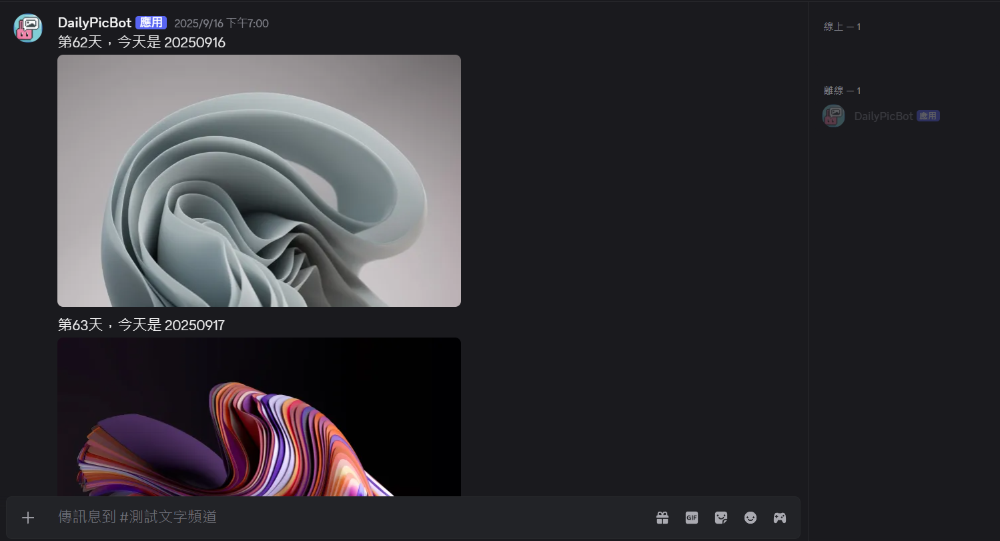
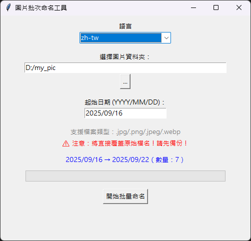
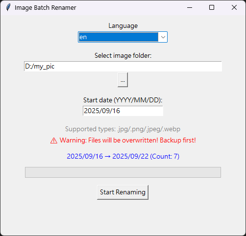

+++
date = '2025-08-01T12:00:00+08:00'
draft = false
title = "DailyMediaTool - 每日自動發圖工具"
tags = ["自動化", "工具"]
+++
## DailyMediaTool - 每日自動發圖工具

### 背景與動機
在使用 Discord 的過程中，我加入一個人數龐大的群組，我發現管理員經常需要每天發送圖片，使得每日發圖成為繁瑣的工作。由於我並不熟悉群組內管理流程，我假設唯一的發圖者需要從自己電腦上傳圖片，因此決定開發 **DailyMediaTool**。

這個工具可以直接讀取使用者電腦本地的圖片，透過 Windows 任務排程器，完成每日定時發圖，省去手動操作，並降低對雲端服務的依賴。

``` terminal
C:\your_name\daily_media_tool\daily_bot>python main.py
2025-09-16 14:11:11 INFO     discord.client logging in using static token
2025-09-16 14:11:13 INFO     discord.gateway Shard ID None has connected to Gateway (Session ID: xxxxxx).
✅ 機器人已上線
```

### 工具組成與特色

#### 1. 每日自動發圖模組
這個模組是一個簡單的 Discord 機器人，會依照資料夾中圖片的日期自動發送當天對應圖片到指定頻道，並附加自訂訊息。發送完成後，Bot 將自動關閉。

**主要功能**：
- 發送完成自動關閉，搭配排程可實現每日自動發送。
- 啟動後等待指定秒數再發送，避免立即發送。
- 支援 jpg、jpeg、png、webp 格式圖片。
- 發送訊息可包含第 N 天計數與自訂文字 `{date}` 佔位符。
- 若找不到當日圖片，會自動發送提示訊息。

<!-- 這裡可以放 Discord 發圖示意圖 -->


#### 2. 圖片批量命名工具（GUI）
為了讓每日圖片與日期對應更加精準，我製作了 **圖片批量命名工具**，提供圖形化介面操作。

**主要功能**：
- 選擇資料夾及自訂起始日期，依序將圖片重新命名為日期格式（YYYYMMDD）。
- 支援單月或跨月圖片數量，自動連號編寫日期。
- UI 即時預覽總量與日期範圍。
- 先暫時改名避免直接覆蓋，再依日期命名。
- 進度條顯示改名進度。
- 支援中文/英文切換（語系文字來源 `lang.json`，預設語言在 `config.json` 設定）。
- 錯誤處理：無效日期、空資料夾等情況會有提示。

批量命名工具中文 UI


批量命名工具英文 UI


### 使用方式

1. 將圖片整理到指定資料夾。  
2. 使用批量命名工具，依起始日期給圖片命名。  
3. 設定 Discord Bot Token、頻道 ID、圖片資料夾路徑，以及透過任務排程器設定排程時間。  
4. 啟動 DailyMediaTool，工具會自動發送對應日期的圖片。  

這樣一來，你就能每天定時在 Discord 頻道自動發送圖片，不需要每日手動發送圖片。

### 注意事項

- 每次發送圖片後，Discord Bot 將會自動關閉，如需持續運行，建議申請專用 Bot 並搭配排程。
- 確保 `config.json` 中的 Token、頻道 ID、圖片路徑等設定正確。
- 圖片檔名需符合日期格式，如 `20250916.jpg`。
- 請妥善保管 Discord Bot Token，避免洩漏。  
- 批量命名工具會覆蓋相同日期檔案，請確認資料夾內只包含想要處理的圖片。
